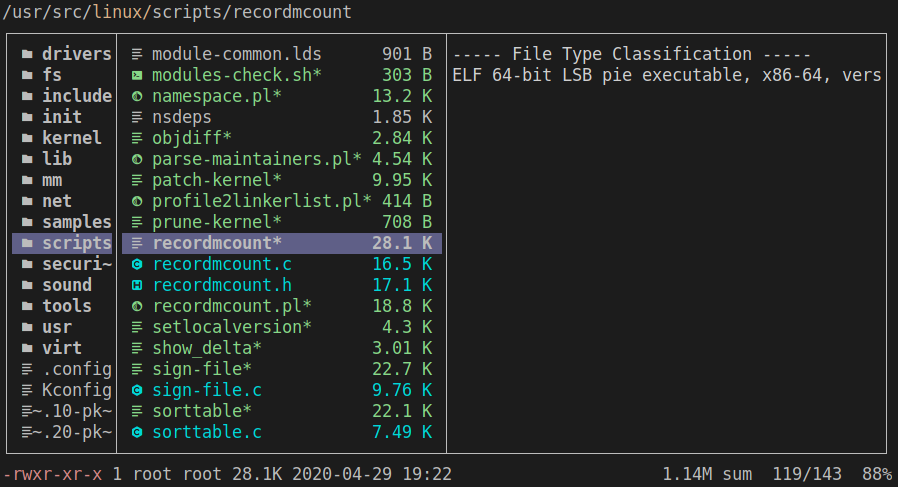

# ranger-devicons2
Adds an icon and type (like `ls -F`) to the ranger's file list



## Why, if ranger-devicons already exists?
- simple sync with vim-devicons: gen_icons.sh
- not only exact match, but also pattern_match (ex: `.*vimrc.*`)
- show "type symbol" (like `ls -F`)

## Installation
1. Install a [Nerd Font compatible font](https://github.com/ryanoasis/nerd-fonts#font-installation) or [patch your own](https://github.com/ryanoasis/nerd-fonts#font-patcher), then set your terminal font

2. Clone:
```sh
git clone https://github.com/cdump/ranger-devicons2 ~/.config/ranger/plugins/devicons2
```

3. Add/change `default_linemode devicons2` in your `~/.config/ranger/rc.conf`

## Acknowledgments
- icons rules autogenerated (with gen_icons.sh) from [vim-devicons](https://github.com/ryanoasis/vim-devicons)
- inspired by [ranger-devicons](https://github.com/alexanderjeurissen/ranger_devicons)
