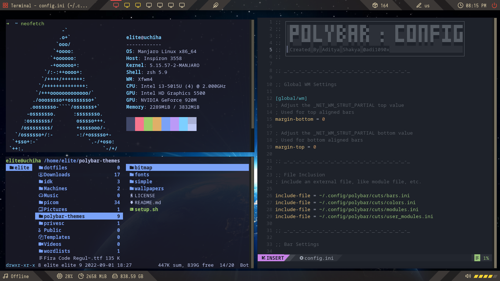

# dotfiles

my xfce dotfiles

# Screenshot

### Edits

- `Polybar` [ credits and source: <a href=https://github.com/adi1090x> adi1090x </a> ]
- Muted `xfce4-panel` (Default manjaro panel)
- `Borderless xfce`
- `Yellow wood style theme` (default)
- `Terminal edits` : gruvbox
 
