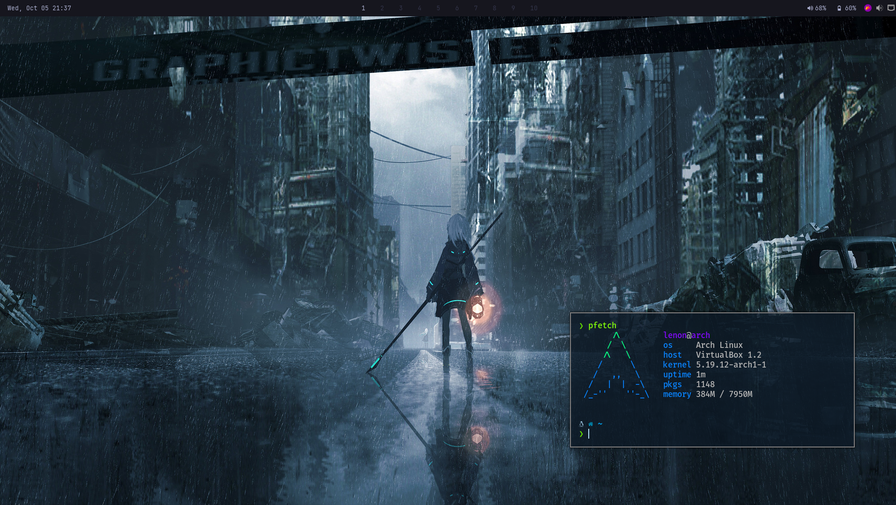
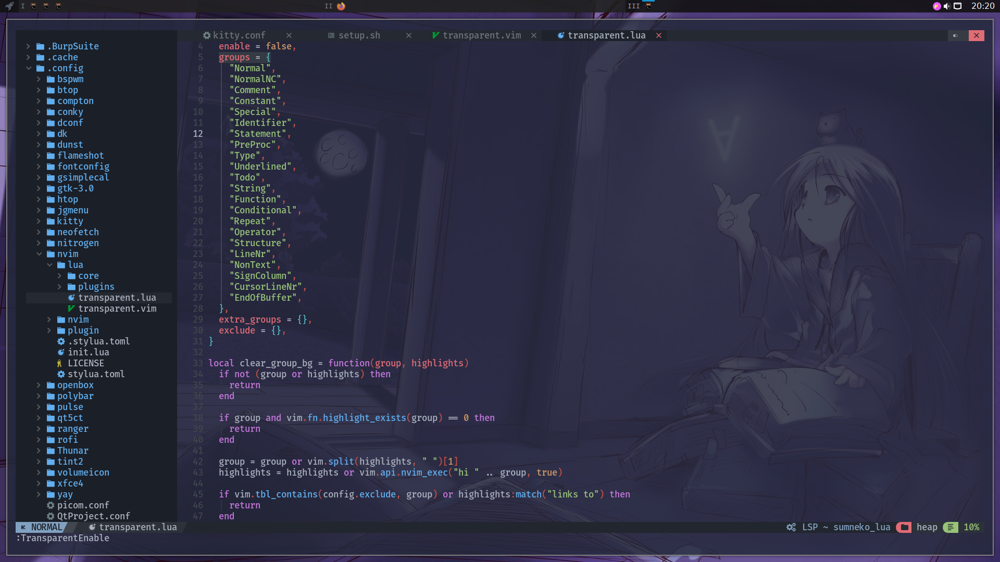
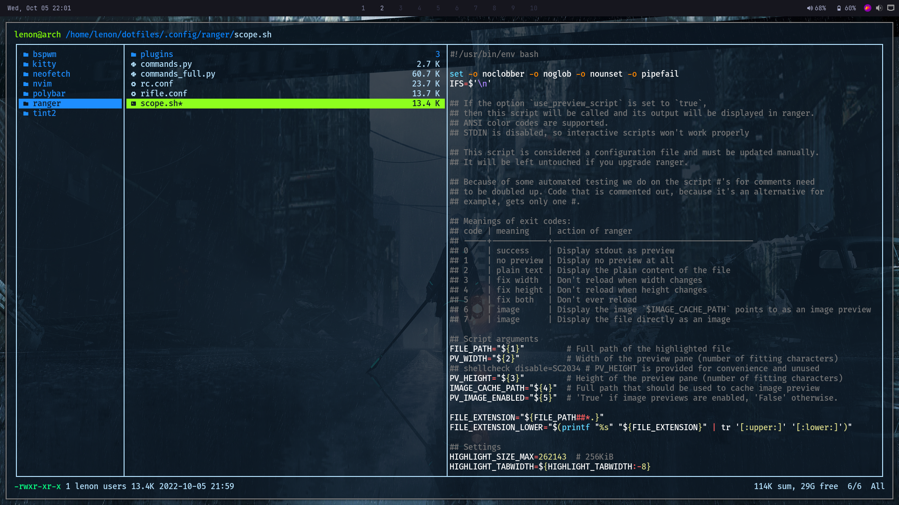
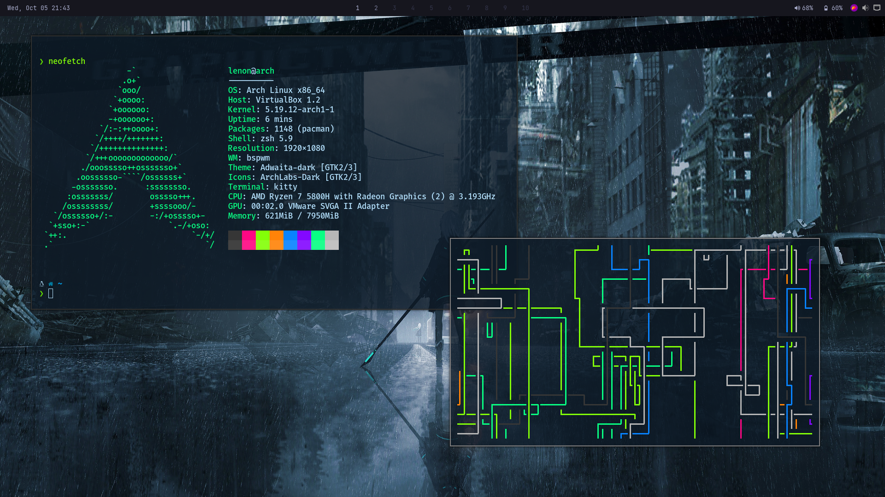

# bspwm dotfiles

# Screenshots 

### Homepage

### Neovim 

### Ranger

- Add `export EDITOR='nvim'` in your `.zshrc` file to set nvim as ranger's default editor.

### polybar

## Showcase 

## Dependencies

- Bspwm (_ofc_)
- polybar
- neovim 0.7>
- ranger
- neofetch
- kitty
- ohmyzsh, powerlevel10k

