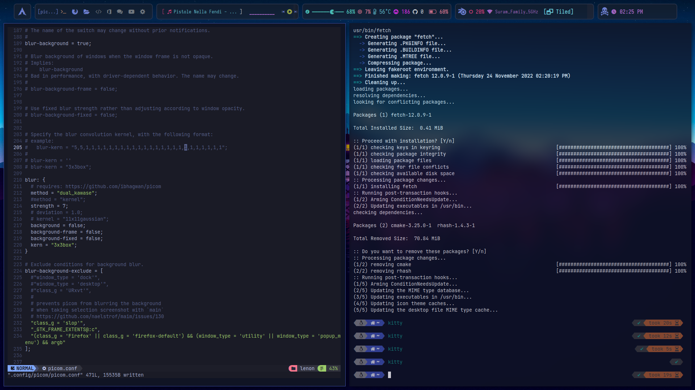
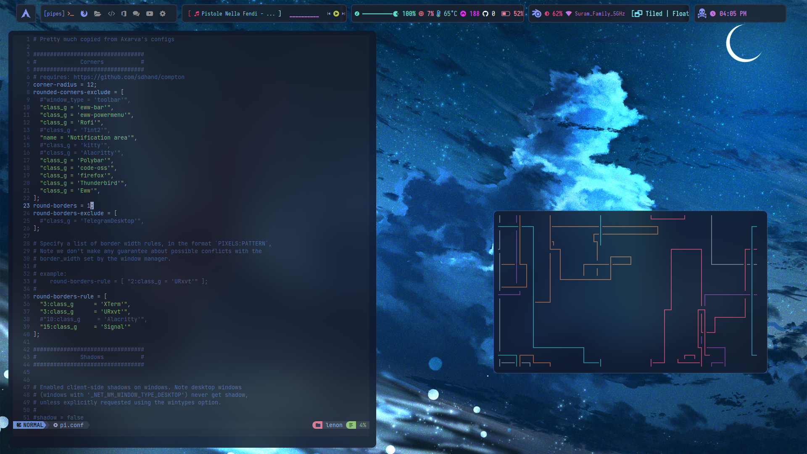

## This repo has 2 branches, dotfiles for xfce and bspwm

# bspwm dotfiles

## Homepage

<!--
  -->

## Picom 

> Added window animations and blur effect, i've added 2 config files, one with all windows with blur effect and the other have no blur effect for current window.

|window blur|Whole blur|
|--|--|
||  

#### Window Animations

<!-- https://user-images.githubusercontent.com/56447720/203771720-8dcf77cb-27e8-487c-b66f-1c36257d548c.mp4 -->

 <!--  -->
| Alactritty/nvim| Ranger|
|--|--|
|  | 

> Add `export EDITOR='nvim'` in your `.zshrc` file to set nvim as ranger's default editor.

<!--  

### Ranger

-->

### polybar

> This is my old polybar, you can find it's configs in the old-polybar folder.

> Neww one.

## Dependencies

- Bspwm (_ofc_)
- polybar
- neovim 0.7>
- ranger
- neofetch
- kitty
- ohmyzsh, powerlevel10k

  

